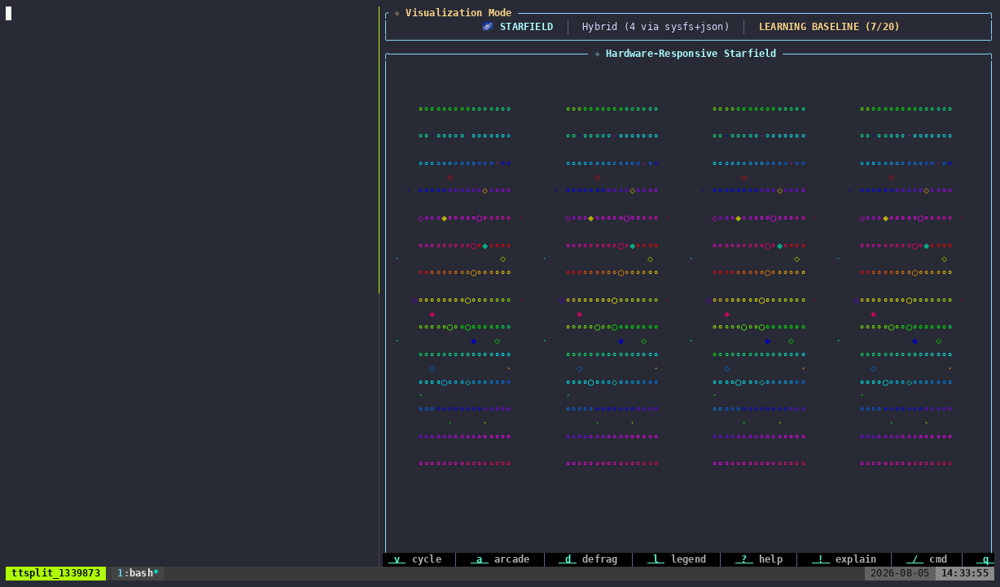
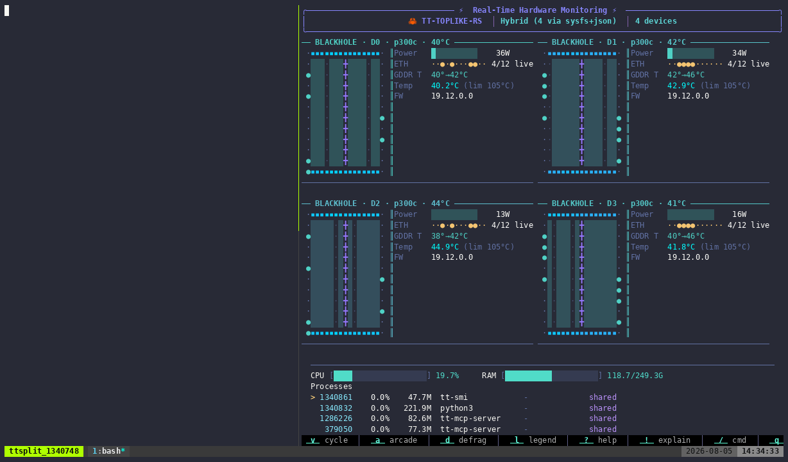

# tt-demo-maker

[](LICENSE)

A reusable, project-agnostic toolkit for authoring **demo recordings and draft posts** from
inside any project. Point it at a TUI/CLI, describe what you want captured, and it turns
that into recorded footage (asciicast / GIF / MP4) **and** a first-draft Markdown post that
pairs each *directive* with the *reaction* it caused.

It exists so recording machinery (tmux + asciinema/VHS + ffmpeg + agg, idle-trimming, a demo
registry, inference-server-aware readiness gating) isn't reinvented per-project.

## See it in action

Three scenes recorded by this toolkit on real hardware — a QuietBox with 4× P300C
(Blackhole) boards — from this repo's own [`demo/demos.yaml`](demo/demos.yaml). In each,
the left pane runs a real ttnn matmul burst on device 0
([`demo/tt-burst.sh`](demo/tt-burst.sh)) and the right pane is
`tt-toplike --backend hybrid` watching live board telemetry. Scenes were captured with
`tt-demo record all` and idle-trimmed with `tt-demo compress`; GIF encoding used
hand-tuned `agg` flags — the exact values now expressed as `defaults.render` in the
manifest since v1.1 added render tuning (see limitations below).

**A short burst (starfield)** — a five-second matmul burst on device 0: clocks jump
800→1350 MHz, power spikes toward 140 W, the starfield flares, then everything settles.



**Sustained load (arcade)** — nine seconds of sustained matmuls; the arcade hero climbs
as device 0 ramps from ~16 W idle toward ~140 W.


**Load ends, power collapses (table)** — when the burst stops, device 0 falls from
~120 W back to idle and clocks drop back to 800 MHz in the live table view.



## How it works

You describe scenes in a small YAML manifest; the toolkit does the terminal ballet:

```yaml
project: tt-toplike
theme: tt-brand
defaults: { cols: 200, rows: 50, backend: "--host", outputs: [cast, gif] }
scenes:
  - id: cold-load
    title: "Cold model load (host proxy)"
    layout: split
    left:  { run: "yes > /dev/null & sleep 6; kill %1" }
    right: { run: "tt-toplike {backend} --mode arcade" }
    duration: 8s
    split_ratio: 40
    caption: "Load ramps the host; the arcade hero climbs as power rises."
```

The full field reference lives in [`skill/manifest-schema.md`](skill/manifest-schema.md).

### Layers

```
description ──▶ /tt-demo skill (LLM: Claude or local Qwen)
                 │  authors/edits demo/demos.yaml, writes narration
                 ▼
            bin/tt-demo  (Rust orchestrator — the stable interface)
                 │  parse+validate manifest, compile scenes, drive flow
                 ▼
            lib/*.sh     (bash capture primitives — the terminal ballet)
                 │  spawn: tmux · asciinema · vhs · Xvfb · xterm · ffmpeg · agg
                 ▼
            demo/assets/*  +  demo/POST.draft.md
```

Full design: [`docs/superpowers/specs/2026-07-18-tt-demo-maker-design.md`](docs/superpowers/specs/2026-07-18-tt-demo-maker-design.md).

## Requirements

- **Rust toolchain** (to build the `tt-demo` binary; edition 2021)
- **Capture tools**, checked by `tt-demo doctor`: `tmux`, `asciinema`, `vhs`, `agg`,
  `ffmpeg`, and — only for MP4 rendering — `Xvfb` + `xterm`. You only need the tools for
  the engines and outputs your scenes actually use.

## Install

```bash
./install.sh
```

This builds the `tt-demo` release binary, symlinks it to `~/.local/bin/tt-demo`, and
symlinks `skill/` to `~/.claude/skills/tt-demo` (so the `/tt-demo` Claude skill is
available in any project). If you invoke `tt-demo` from outside this repo, set
`TT_DEMO_HOME=/path/to/tt-demo-maker` so it can find `lib/`, `templates/`, and `themes/`.

## Quickstart

From the root of any project you want to demo:

```bash
tt-demo doctor                 # check for tmux, asciinema, vhs, agg, ffmpeg, Xvfb, xterm
tt-demo init                   # scaffold demo/demos.yaml, demo/assets/, demo/.gitignore
$EDITOR demo/demos.yaml        # describe your scenes — see skill/manifest-schema.md
tt-demo record --dry-run       # validate + print the capture plan; touches no hardware
tt-demo rehearse <id>          # preflight: does the directive move real telemetry?
tt-demo record all             # capture every scene (single/split/serve-wait as declared)
tt-demo compress demo/assets/<id>.cast   # idle-trim -> <id>.min.cast (render prefers it)
tt-demo render <id> --gif      # (or --mp4) themed + tuned via defaults.render
tt-demo verify <id>            # contact-sheet PNG of the rendered footage
tt-demo publish all --readme README.md   # copy artifacts + splice the gallery
tt-demo post --narrate claude  # assemble demo/POST.draft.md (narration written by the skill)
```

`tt-demo list` shows every scene's resolved engine (`vhs`/`asciinema`) and whether it's been
recorded yet.

## Using the `/tt-demo` skill

Once installed, ask your agent (in any project) something like "record a short demo of the
cold-load causing the arcade viz to react" and the `/tt-demo` skill will author/edit
`demo/demos.yaml`, drive the CLI above, and write the narration in `demo/POST.draft.md`.
See [`skill/SKILL.md`](skill/SKILL.md) for the exact steps it follows and
[`skill/manifest-schema.md`](skill/manifest-schema.md) for the full manifest field reference.

## Reference example

[`examples/demos.yaml`](examples/demos.yaml) is the tt-toplike reference manifest — three
scenes (`qa-short`, `cold-load`, `reset-lightshow`) built entirely from `tt-toplike --host`
(no ASIC needed), so the whole pipeline is runnable and CI-testable without hardware. Copy
it into a project as a starting point:

```bash
mkdir -p demo && cp examples/demos.yaml demo/demos.yaml
```

This repo's own [`demo/demos.yaml`](demo/demos.yaml) is the complementary *real-hardware*
example — the manifest behind the footage at the top of this README.

## Non-invasive by default

Demo scene commands should prefer `--host` or `--backend hybrid` (interpolated via the
`{backend}` token in `defaults.backend`) over touching real hardware directly — this keeps
demos safe to record on shared boxes and runnable in CI via `--dry-run`.

## Repository layout

```
bin/        Rust orchestrator (the tt-demo CLI): manifest parsing, scene
            compilation, record/compress/render/post subcommands
lib/        bash capture primitives: tmux_capture.sh, split.sh, serve.sh,
            render.sh, driver.sh
skill/      the /tt-demo Claude skill + manifest schema reference
templates/  minijinja templates: VHS tape, asciinema driver, POST.draft.md
themes/     VHS theme tapes (tt-brand, dracula)
examples/   the tt-toplike reference manifest
tests/      hardware-free end-to-end golden test
docs/       design spec and implementation plan
```

## Testing

The end-to-end golden test exercises the whole pipeline —
init → record (real single-pane capture) → compress → render GIF → post —
with no hardware and no network:

```bash
./tests/e2e_golden.sh
```

It builds the release binary if needed and runs everything in a throwaway temp directory.

## v1 limitations / v1.1

**Delivered in v1.1** (born from recording the footage above by hand):

- `tt-demo compress` writes `<id>.min.cast` by default (the name `render` prefers);
  `--stdout` restores the old pipe behavior.
- `defaults.render` manifest options (`fps_cap`, `font_size`, `speed`) and theme-matched
  agg palettes (`themes/<theme>.agg`) — `render --gif` is now themed and size-tunable.
- `tt-demo rehearse <id>` — run a scene's directive while sampling `tt-smi`, report the
  idle→load delta per device, and (with `--require-reaction`) hard-fail when the board
  wouldn't visibly react. Catches quiet-board footage before it's recorded.
- `tt-demo verify <id>` — tile frames of the rendered artifact into a contact-sheet PNG
  for visual QA without playing it.
- `tt-demo publish` — copy artifacts from gitignored `demo/assets/` into a committed dir
  and emit/splice a markdown gallery (between `<!-- tt-demo:gallery:begin/end -->` markers).

`tt-demo record` (non-dry-run) drives declarative (`left`/`right`) scenes straight through
the tested `lib/*.sh` capture primitives, using each scene's raw `run:` commands. The
following remain deferred:

- **Raw-hatch CLI capture.** `raw_tape`/`raw_script` scenes are recognized and skipped
  cleanly (no error) rather than executed — run VHS/asciinema on them by hand for now.
- **Compiled-tape/driver execution.** `compile_scene`'s rendered VHS tape / asciinema
  driver text (`Compiled.text`) is produced and validated (compile-time only) but never
  executed by `record`; real capture goes through `lib/tmux_capture.sh`/`lib/split.sh`
  directly against the scene's raw commands instead. The compiled-driver's own shell
  quoting (`Debug`-repr, in `compile.rs`) also isn't POSIX-shell-safe yet — fine for the
  unexecuted text today, but must be fixed before that path is wired up.
- **MP4 rendering is unexercised.** `lib/render.sh mp4` (Xvfb + xterm + ffmpeg) exists but
  has no automated coverage here — it needs a display server most CI runners don't have.
- **Server stop / board reset on switch.** `Step::Switch` starts the next scene's server
  and waits for its readiness gate, but never stops whatever was running before it or runs
  a `tt-smi -r` board reset — switching between two exclusive hardware-backed servers back
  to back is not yet safe to automate.
- **Single-pane scenes with multi-statement commands.** When `right.run` is a multi-statement
  sequence (e.g. `"setup; long-viz"`), the entire command is backgrounded as a subshell,
  but individual non-terminating sub-steps are not separately managed — the kill/wait safety
  net covers the whole sequence, not intermediate steps.
- **Automated server start/readiness testing.** The `Step::Switch` server start + readiness-gating
  path (`serve.sh` + `poll_http`/log-wait) is verified manually but has no automated test
  coverage yet — planned for v1.1.

## License

[Apache-2.0](LICENSE)
